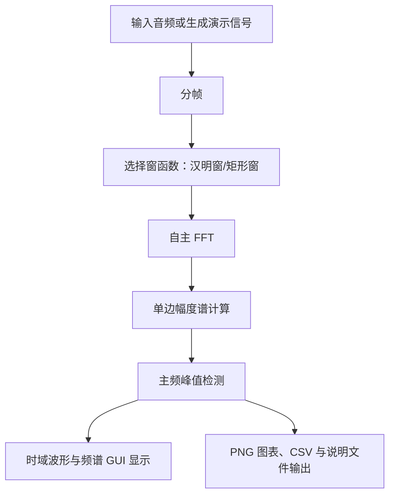

# 基于快速傅里叶变换（FFT）的音频信号频谱分析仪设计报告

## 1. 设计目标

本课程设计实现一个音频信号频谱分析仪，主要目标如下：

1. 自主实现 FFT 算法，支持非 2 的整数次幂长度输入自动补零。
2. 使用正弦波、双音信号、方波等合成信号验证 FFT 正确性，并与 `numpy.fft.fft` 结果比较。
3. 对音频信号进行分帧、加窗、FFT 幅度谱计算和主要频率识别。
4. 设计实时动态 GUI，同时显示音频时域波形和频域幅度谱，支持播放/暂停、窗函数选择、线性/对数频率刻度切换。

## 2. FFT 算法原理与复杂度

离散傅里叶变换 DFT 定义为：

```text
X[k] = sum(x[n] * exp(-j * 2πkn / N)), n = 0..N-1
```

直接计算 DFT 时，每个频点都需要对全部 N 个采样点求和，共 N 个频点，因此时间复杂度为 `O(N^2)`。

本项目采用基 2 时间抽取 Cooley-Tukey FFT。算法把长度为 N 的序列拆成偶数下标序列和奇数下标序列：

```text
X[k] = E[k] + W_N^k O[k]
X[k + N/2] = E[k] - W_N^k O[k]
```

其中 `W_N^k = exp(-j * 2πk / N)`。通过递归/迭代拆分，FFT 只需要 `log2(N)` 层蝶形运算，每层约 N 次运算，因此时间复杂度降为 `O(N log N)`。例如 N=1024 时，DFT 约需 1,048,576 级别乘加，FFT 约需 10,240 级别蝶形计算，效率差异明显。

本项目在 `src/fft_core.py` 中使用迭代蝶形实现，步骤为：

1. 输入转换为复数数组。
2. 若长度不是 2 的整数次幂，则补零到最近的 2 的整数次幂。
3. 执行位反转重排。
4. 按 `2, 4, 8, ..., N` 的蝶形跨度逐层合并。
5. 输出完整复频谱。

## 3. 程序结构与流程

整体流程如下：



关键模块说明：

- `src/fft_core.py`：自主 FFT、IFFT、单边幅度谱、主要峰值检测。
- `src/spectrum.py`：音频分帧、窗函数、逐帧频谱分析。
- `src/audio_io.py`：标准库 WAV 读写。
- `src/gui_tk.py`：Tkinter 实时可视化界面。
- `examples/validate_fft.py`：使用 `numpy.fft.fft` 作为参考验证算法精度。
- `examples/analyze_audio.py`：生成演示音频、输出波形图、频谱图和主要频率 CSV。

## 4. 关键代码说明

FFT 主函数为 `fft(signal, n=None)`：

- `next_power_of_two` 负责计算补零长度。
- `_bit_reverse_indices` 负责生成位反转下标。
- 主循环中 `size` 表示当前蝶形组长度，`half=size/2`。
- `twiddles = exp(-2j*pi*k/size)` 为旋转因子。
- 每组蝶形使用 `even + odd` 和 `even - odd` 完成合并。

音频分析函数为 `analyze_audio(samples, sample_rate, frame_size, hop_size, n_fft, window_name)`：

- 默认帧长 2048，帧移 1024，满足 FFT 点数 1024 以上要求。
- 支持汉明窗和矩形窗。
- 每帧调用自主 FFT 得到单边幅度谱。
- 通过局部极大值排序得到主要频率成分。

## 5. 实验结果

### 5.1 FFT 正确性验证

运行：

```powershell
python examples\validate_fft.py
```

得到结果：

| 信号 | 最大绝对误差 | 平均绝对误差 | 识别主频 |
|---|---:|---:|---:|
| 1000 Hz 正弦波 | 1.820e-13 | 3.736e-15 | 1000.0 Hz |
| 440/880 Hz 双音 | 1.657e-13 | 4.054e-15 | 437.5 Hz |
| 500 Hz 方波 | 2.542e-13 | 4.985e-15 | 500.0 Hz |
| 非 2 次幂长度输入 | 2.132e-13 | 4.848e-15 | 1234.4 Hz |

误差均在浮点舍入误差范围内，说明自主 FFT 与参考实现结果一致。双音信号中 440 Hz 被识别为 437.5 Hz，是因为 `fs=16000, N=2048` 时频率分辨率为：

```text
Δf = fs / N = 16000 / 2048 = 7.8125 Hz
```

440 Hz 对应最近频点为 437.5 Hz，符合理论预期。

### 5.2 音频频谱分析

运行：

```powershell
python examples\analyze_audio.py
```

程序生成演示音频 `assets/demo_audio.wav`，其中包含 440 Hz、660 Hz、880 Hz 等成分。分析输出中间帧主要频率：

| 排名 | 频率/Hz | 说明 |
|---:|---:|---|
| 1 | 437.50 | 对应 440 Hz 基音附近频点 |
| 2 | 656.25 | 对应 660 Hz 成分附近频点 |
| 3 | 882.81 | 对应 880 Hz 成分附近频点 |
| 4 | 156.25 | 由合成信号包络和混合成分产生 |
| 5 | 187.50 | 由合成信号包络和混合成分产生 |

生成图像和结果说明：

- `assets/时域波形.png`：时域波形，横轴为时间 `t/s`，纵轴为幅值 `A`。
- `assets/汉明窗幅度谱.png`：汉明窗幅度谱，横轴为频率 `f/Hz`，纵轴为幅度 `|X(f)|`。
- `assets/矩形窗幅度谱.png`：矩形窗幅度谱，用于和汉明窗结果比较。
- `assets/主要频率成分.csv`：主要频率成分表，字段和说明均为中文。
- `assets/频谱分析结果说明.md`：实验结果中文说明。

汉明窗能够降低旁瓣泄漏，使主频附近的频谱更平滑；矩形窗主瓣较窄，但旁瓣较高，频谱泄漏更明显。

## 6. GUI 设计

运行：

```powershell
python app.py
```

界面功能：

- “打开 WAV”：读取本地音频。
- “生成演示”：生成并保存示例音频。
- “播放/暂停”：动态推进分析帧，形成实时频谱效果；Windows 下会尝试异步播放 WAV。
- “窗函数”：在 Hamming 与 Rectangular 间切换。
- “频率刻度”：在线性和对数频率轴之间切换。
- 上方画布显示时域波形 `x(t)`，坐标轴为“时间 `t/s`”和“幅值 `A`”。
- 下方画布显示频域幅度谱 `|X(f)|`，坐标轴为“频率 `f/Hz`”和“幅度 `|X(f)|`”，并标注前几个主频峰值。

## 7. 问题总结与改进方向

已完成的功能覆盖了课程设计要求：自主 FFT、正确性验证、分帧加窗频谱分析、主要频率标注和实时 GUI。

仍可改进的方向：

1. 增加麦克风实时采集，可选用 `sounddevice` 或 `pyaudio`。
2. 增加声谱图瀑布图，用颜色表示时间-频率-幅度变化。
3. 对峰值进行抛物线插值，提高频率估计精度。
4. 增加更多窗函数，如 Hann、Blackman、Kaiser。
5. 使用 PyQt 或 DearPyGui 优化界面观感和刷新性能。
